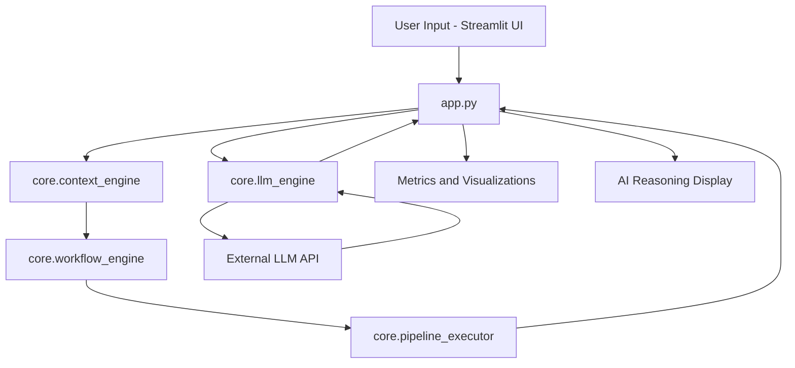
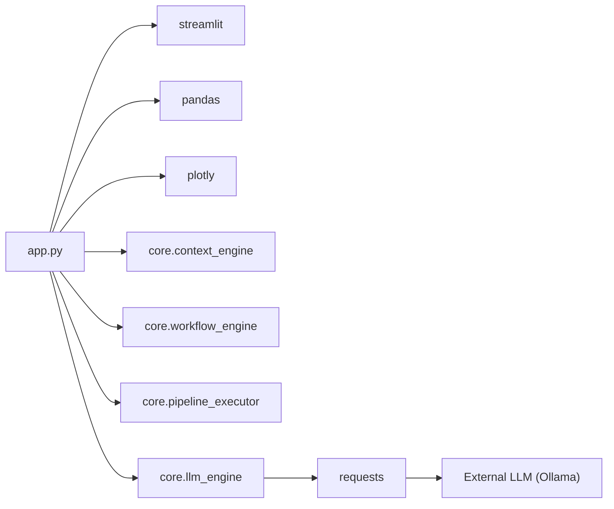

# CodeOwn

## 1. PROJECT OVERVIEW
**In plain English**
This project, named "AWIP – Adaptive Workflow Intelligence Platform," provides an interactive user interface built with Streamlit to help developers and operations teams understand, adapt, and manage data processing and AI/ML workflows. It aims to solve the problem of opaque or static workflows by introducing AI-driven intelligence for contextual understanding, dynamic adaptation, and transparent execution. The final outcome is a comprehensive dashboard that displays key performance indicators, visualizes workflow execution, and offers AI-generated reasoning and insights to improve decision-making and operational efficiency.

**System type**
An interactive AI-driven workflow intelligence platform with a Streamlit-based web interface.

**User / input / output**
- User: Enterprise users, data scientists, machine learning engineers, and operations teams interested in monitoring and optimizing AI-driven workflows.
- Input: User interactions within the Streamlit UI (e.g., selecting workflows, triggering analysis, providing feedback), internal system metrics, and data processed by the workflows.
- Output: Dynamic charts and graphs displaying performance metrics, AI-generated reasoning and explanations for workflow behavior, adaptive workflow suggestions, and a live visualization of workflow steps.

**Tech stack**
- Python
- Streamlit (for UI)
- Pandas, NumPy (for data manipulation)
- Plotly (for interactive visualizations)
- Requests (for HTTP communication, likely with LLMs)
- Local/External Large Language Model (LLM) services (inferred from `http://localhost:11434/api/tags` endpoint in `app.py`)

**Architectural purpose**
The parts of this system exist together to integrate a user-friendly frontend with a backend of specialized AI "engines" for intelligent, adaptive management and visualization of complex data and AI workflows.

## 2. SYSTEM FLOW
This project centers around the `app.py` Streamlit interface, which orchestrates the interactions between the user and several backend AI engines.

User opens `app.py` (Streamlit UI)
-> `app.py` initializes the `LLMEngine` and checks for a running LLM service.
-> `app.py` renders the dashboard layout, metrics, and interactive elements.
-> User provides input via the `app.py` UI (e.g., selects a workflow, triggers an analysis).
-> `app.py` forwards user requests or system state to `core.context_engine` to understand the current operational context.
-> `core.context_engine` processes the context and may feed information to `core.workflow_engine`.
-> `core.workflow_engine` analyzes the context and existing workflows, deciding if adaptation is needed.
-> `core.workflow_engine` may generate or modify a pipeline execution plan and sends it to `core.pipeline_executor`.
-> `core.pipeline_executor` executes the data processing and AI model tasks.
-> `core.pipeline_executor` sends execution results and metrics back to `app.py`.
-> `app.py` updates the UI with new data using `pandas` and visualizes it with `plotly`.
-> `app.py` also sends prompts/data to `core.llm_engine` to generate natural language reasoning and explanations based on the current state or results.
-> `core.llm_engine` interacts with an `External LLM API` (e.g., Ollama) to get responses.
-> `core.llm_engine` returns LLM responses to `app.py`.
-> `app.py` displays the `AI Reasoning` and updated `Metrics and Visualizations` to the user.
-> The user continues interacting with the `app.py` UI, closing the loop.

## 3. FILE BREAKDOWN
### app.py
**What it does**
This file serves as the main entry point and the user interface (UI) for the Adaptive Workflow Intelligence Platform, rendering an interactive dashboard using Streamlit.

**Receives input from**
- User interactions via the Streamlit UI (buttons, sliders, text inputs)
- Responses and data from `core.llm_engine`
- Contextual information from `core.context_engine`
- Workflow adaptation details from `core.workflow_engine`
- Execution results and metrics from `core.pipeline_executor`

**Sends output to**
- The web browser as the rendered Streamlit UI
- `core.context_engine` (user queries, data points for context analysis)
- `core.workflow_engine` (requests for workflow adaptation)
- `core.pipeline_executor` (commands to execute pipelines)
- `core.llm_engine` (prompts for generating reasoning)

**Connected to**
- `core.context_engine`: Used to understand the current operational context.
- `core.workflow_engine`: Consumes data to adapt workflows.
- `core.pipeline_executor`: Orchestrates the execution of data and AI pipelines.
- `core.llm_engine`: Interfaces with Large Language Models for generating insights.
- `streamlit`: The primary framework for building the UI.
- `pandas`, `numpy`, `plotly.express`, `plotly.graph_objects`: For data handling and visualization.
- `requests`: Used to check LLM API status and interact with the LLM.

### core.context_engine (inferred)
**What it does**
This module is likely responsible for processing raw data and user queries to derive and maintain an understanding of the current operational context within the platform.

**Receives input from**
- `app.py` (e.g., raw data streams, user-defined parameters, past workflow states)

**Sends output to**
- `app.py` (summarized context, key data points)
- `core.workflow_engine` (contextual data for adaptation decisions)

**Connected to**
- `app.py`: Provides initial data and receives processed context.
- `core.workflow_engine`: Feeds contextual understanding into workflow adaptation logic.

### core.workflow_engine (inferred)
**What it does**
This module is responsible for analyzing the current context and system goals to adapt or generate optimal workflow execution plans.

**Receives input from**
- `app.py` (user preferences, explicit workflow triggers)
- `core.context_engine` (contextual insights)

**Sends output to**
- `app.py` (proposed workflow changes, current workflow state)
- `core.pipeline_executor` (instructions for executing the adapted workflow)

**Connected to**
- `app.py`: Receives high-level commands and reports workflow status.
- `core.context_engine`: Consumes context to make adaptation decisions.
- `core.pipeline_executor`: Orchestrates the execution based on its adaptation.

### core.pipeline_executor (inferred)
**What it does**
This module manages the execution of data processing and machine learning pipelines, ensuring tasks are run efficiently and their outcomes are captured.

**Receives input from**
- `app.py` (direct execution commands)
- `core.workflow_engine` (adapted pipeline definitions or execution instructions)

**Sends output to**
- `app.py` (pipeline execution status, processed data, performance metrics)

**Connected to**
- `app.py`: Reports execution progress and results.
- `core.workflow_engine`: Receives adapted pipeline instructions.

### core.llm_engine (inferred)
**What it does**
This module abstracts the interaction with Large Language Models, handling API calls, prompt formatting, and parsing LLM responses to provide natural language understanding and generation capabilities.

**Receives input from**
- `app.py` (text prompts, data snippets for analysis, status check requests)

**Sends output to**
- `app.py` (LLM-generated text, reasoning, confirmation of LLM availability)
- External LLM API (formatted requests)

**Connected to**
- `app.py`: Provides LLM services to the UI.
- `requests`: Used for making HTTP calls to the LLM API.
- `External LLM API`: The external service (e.g., Ollama running locally) that actually processes the language requests.

## 4. SYSTEM FLOW DIAGRAM

## 5. FILE DEPENDENCY GRAPH

## Mental Model
*   This project is an interactive dashboard built with Streamlit, serving as the user-facing control center.
*   Its core purpose is to leverage AI to help users understand and dynamically adapt complex data and AI workflows.
*   The system's "intelligence" is modularized into dedicated Python "engines" (Context, Workflow, Pipeline, LLM) that handle specific AI-related tasks.
*   A key component is the integration with Large Language Models, which provide natural language reasoning and contextual insights to the UI.
*   The platform provides a continuous feedback loop: users interact, AI engines process and adapt, results are visualized, and AI offers explanations.
