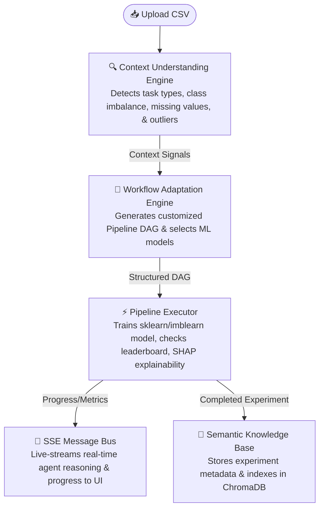
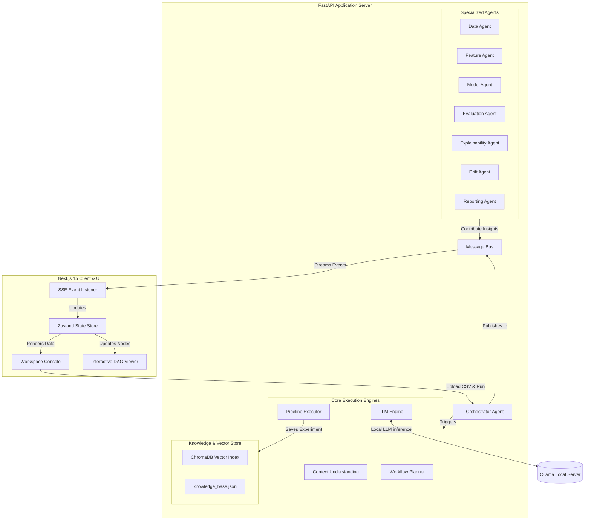

# 🌌 AWIP — Adaptive Workflow Intelligence Platform


-orange?style=for-the-badge&logo=ollama&logoColor=white)


> **AWIP is an autonomous AI-driven data science workspace. Drop a CSV dataset, and an coordinated team of specialized AI agents analyzes your data, handles issues, builds adaptive machine learning pipelines, trains models, explains results, and preserves historical experiment knowledge automatically.**

---

## 🔄 The Autonomous Machine Learning Loop

AWIP handles the tedious, error-prone manual labor of preparing data and training machine learning models. Here is how data flows through the system in under 60 seconds:



---

## 💡 What is AWIP?

AWIP replaces static, rigid machine learning templates with a self-evolving, adaptive pipeline system. It acts as an automated data science team:

*   **For Non-Experts:** Get a fully functioning, optimized machine learning model and prediction insights by uploading a CSV—no code needed.
*   **For Data Scientists:** Save hours of boilerplate code for scaling, encoding, class-imbalance sampling, and outlier filtering.
*   **For Developers:** Package and export trained pipelines with reproducible Python code and detailed explainability reports.

---

## 🏗️ Full-Stack Agentic Architecture

AWIP is designed as a modular, event-driven system with a dedicated FastAPI backend and a real-time Next.js frontend:



### The AI Agent Team

AWIP divides orchestration among specialized sub-agents communicating over an in-memory Message Bus:
*   **Data Agent:** Inspects dataset dimensions, schema quality, missing values, and outlier concentrations.
*   **Feature Agent:** Performs automated feature engineering (lag features, datetime parsing, target encoding).
*   **Model Agent:** Trains candidate models, ranks them on a leaderboard, and selects the optimal classifier/regressor.
*   **Evaluation Agent:** Audits evaluation scores, flags metrics with high variance, and warns of overfitting.
*   **Explainability Agent:** Computes SHAP values, explaining which features drive predictions.
*   **Drift Agent:** Tracks distribution shifts (using Kolmogorov-Smirnov tests) when uploading new dataset versions.
*   **Reporting Agent:** Compiles comprehensive executive markdown summaries exportable to PDF and Word.

---

## 🛠️ Tech Stack Matrix

| Layer | Technologies Used |
| :--- | :--- |
| **Backend API** | FastAPI (Python 3.9+), Uvicorn, SQLite/SQLAlchemy |
| **Machine Learning** | Scikit-Learn, XGBoost, LightGBM, Imbalanced-Learn |
| **Analytics & Stats** | SciPy, Pandas, NumPy, SHAP (SHapley Additive exPlanations) |
| **Vector Search** | ChromaDB (local persistence for semantic search) |
| **Report Generation**| FPDF (PDF creation), python-docx (Word Document creation) |
| **Frontend UI** | Next.js 15 (App Router), React, TypeScript |
| **State Management** | Zustand (Global client state storage) |
| **Visualizations** | XYFlow/React (DAG interactive rendering), Recharts (leaderboard graphing) |
| **LLM Integration** | Ollama (local server for private model runs: Llama3, Phi3, etc.) |
| **Legacy UI** | Streamlit (Optional standalone `app.py` script) |

---

## 📁 Repository Blueprint

```
AWIP/
├── backend/                  # FastAPI Application Code
│   ├── core/                 # Orchestration, Signal Analysis, & Execution Engines
│   │   ├── agents/           # Core AI sub-agents (data, model, feature, etc.)
│   │   ├── context_engine.py # Statistical dataset analyzer
│   │   ├── pipeline_executor.py # Translates DAGs into trained Sklearn pipelines
│   │   └── workflow_engine.py # Formulates step-by-step pipeline DAGs
│   ├── database.py           # Database models and configuration stubs
│   └── main.py               # REST API endpoints & SSE stream router
│
├── frontend/                 # Next.js Application Code
│   ├── src/
│   │   ├── app/              # Next.js pages & router
│   │   ├── components/       # Interface widgets (DAG view, Leaderboard, SSE Chat)
│   │   └── store/            # Zustand global state (workspaceStore.ts)
│   └── package.json          # Node dependencies
│
├── sample_data/              # Sample CSV datasets (clean vs. drifted data)
├── app.py                    # Standalone legacy Streamlit console (for reference)
├── start.bat                 # One-click Windows Launcher script
└── requirements.txt          # Python dependencies list
```

---

## ⚡ Getting Started

### 🔌 Windows One-Click Start (Recommended)
If you are on Windows, double-click **`start.bat`** in the project root. This launcher script will automatically:
1. Fire up the FastAPI backend on `http://127.0.0.1:8000`
2. Start the Next.js dev server on `http://localhost:3000`
3. Launch your web browser to open the dashboard workspace.

---

### 🛠️ Manual Terminal Startup

Follow these steps to run the backend and frontend separately in two terminal windows:

#### 1. Start the Backend API
```bash
# Navigate to backend directory
cd backend

# Create & activate a virtual environment
python -m venv .venv
source .venv/bin/activate  # On Windows, use: .venv\Scripts\activate

# Install required Python dependencies
pip install -r ../requirements.txt

# Run the FastAPI server
uvicorn main:app --reload --host 127.0.0.1 --port 8000
```

#### 2. Start the Frontend Client
```bash
# Open a new terminal and navigate to frontend directory
cd frontend

# Install package dependencies
npm install

# Start the Next.js development server
npm run dev
```
Open **[http://localhost:3000](http://localhost:3000)** in your browser.

#### 3. Start Local Ollama (Optional)
If you want to use the local LLM reasoning engine and side-docked AI Copilot chat:
1. Download and install [Ollama](https://ollama.com/).
2. Run the following command in a separate terminal:
   ```bash
   ollama run llama3
   ```
   *(AWIP will fall back to smart rule-based explanations automatically if Ollama is not active).*

---

## ⚙️ Core Engines & Automated Decision Logic

AWIP does not use static template pipelines. Instead, it inspects your CSV and configures your pipeline dynamically based on the following signals:

### 1. Context Understanding Engine (CUE)
*   **Missing Values:** Checks each column. If missing values are detected, it inserts a `KNNImputer` or `IterativeImputer` depending on column type and size.
*   **Outlier Checking:** Scans numerical data for values exceeding $\pm 3\sigma$. If outliers are found, it switches standard scalers to `RobustScaler`.
*   **Imbalance Handling:** If class distributions exhibit heavy skew, the system introduces `SMOTE` or `SMOTE-Tomek` resampling into the pipeline structure.
*   **Multicollinearity Check:** Scans features for highly correlated pairs ($r > 0.9$) and recommends dropping redundant columns.
*   **Task Inference:** Automatically identifies if the dataset represents a classification, regression, clustering, time-series, or NLP task.

### 2. Workflow Adaptation Engine (WAE)
Constructs a Directed Acyclic Graph (DAG) representing processing nodes (Scaler $\rightarrow$ Imputer $\rightarrow$ Feature Selection $\rightarrow$ Resampling $\rightarrow$ Model Estimator). It automatically designs this workflow and sends it to the frontend to render as an interactive node graph.

---

## 🎯 What to Expect (Honest Capabilities)

AWIP is an active data science prototype. To help align expectations, here is what is fully supported, and what is currently planned or limited:

### ✅ Fully Operational Features
*   **Zero-Config Automation:** Upload a CSV and pick a target. The workspace runs everything autonomously without user input.
*   **Real-time Interaction:** Live agent thoughts are streamed to your screen via SSE.
*   **Model Leaderboard:** Compares and ranks multiple models (e.g., XGBoost vs. LightGBM vs. Random Forests) in real-time.
*   **Explainability:** Displays exact feature importance charts using SHAP values.
*   **Drift Monitor:** Compares subsequent uploads using Kolmogorov-Smirnov statistics to detect distribution shifts.
*   **Report Studio:** Generates PDF and Word reports summarizing model performance.
*   **Semantic Search:** Queries past experiments semantically via ChromaDB.

### ⚠️ Current Limitations
*   **Local State:** Session state is held in-memory in the FastAPI application. If the backend restarts, the active workspace session resets.
*   **Basic Tuning:** The leaderboard trains models using optimized, predefined default parameters (no extensive hyperparameter search like Optuna).
*   **Data Limit:** Primarily optimized for tabular data (CSVs). It does not support unstructured data like images, audio, or video files yet.
*   **Local LLM Speed:** LLM reasoning speed is dependent on your local system resources.
