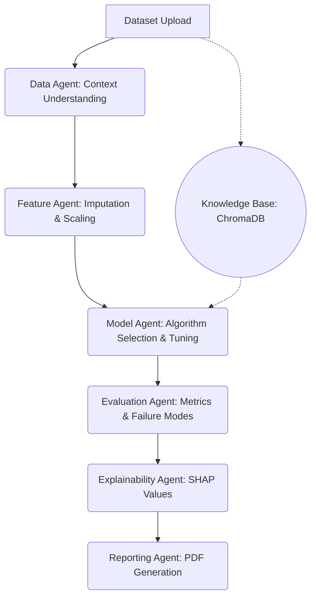

# AWIP: Adaptive Workflow Intelligence Platform 🚀

<div align="center">
  <p><strong>The platform that does the data science so you don't have to.</strong></p>
  <p>An end-to-end autonomous data science orchestration engine.</p>
</div>

<br />

<div align="center">
  
  
  
  
</div>

<br />

## 🎯 What is AWIP?

AWIP is an autonomous execution engine that completely automates the machine learning pipeline. 

You upload a dataset, and AWIP's **7-Agent AI Team** takes over. It identifies missing data, handles categorical encoding, designs a customized `scikit-learn` pipeline, trains multiple models (XGBoost, Random Forest, LightGBM), evaluates the winner using SHAP values, and generates an executive PDF report.

It is **not** just a chatbot. It is a deterministic, rule-based execution engine enhanced by an (optional) local LLM, providing reliable, production-ready outputs.

---

## ✨ Key Features

- **The `auto` Endpoint**: Send a CSV, get a fully analyzed PDF report in seconds. (`POST /api/orchestrate/auto`)
- **7-Agent AI Team**: Specialized agents handle Data, Features, Models, Evaluation, Explainability, Drift, and Reporting.
- **SQLite Persistence**: Your sessions survive server restarts.
- **Knowledge Base**: Past workflows are automatically saved as Experiments and can be queried via ChromaDB.
- **Optional LLM**: Runs flawlessly on fast, intelligent rule-based logic. Ollama can be used to optionally enhance explanations, but is never required.
- **Beautiful Next.js Frontend**: A stunning, premium dark-mode interface for monitoring the AI team's execution in real-time.
- **1-Click Export & Deploy**: Export the final trained pipeline as an executable Jupyter Notebook, or instantly download a ZIP containing a FastAPI serving application and Dockerfile.

---

## 🏗️ Architecture



---

## 🚀 Quick Start

### 1. Prerequisites
- Python 3.12+
- Node.js 18+
- [uv](https://github.com/astral-sh/uv) (Extremely fast Python package manager)

### 2. Backend Setup
The backend environment and dependencies are neatly isolated in the `backend/` directory.

```bash
# Navigate to the backend directory
cd backend

# Install dependencies using uv
uv pip install -r requirements.txt

# Start the FastAPI server
uv run uvicorn main:app --reload --port 8000
```
*The backend runs on `http://127.0.0.1:8000`*

### 3. Frontend Setup
The frontend is a modern Next.js 14 application powered by TailwindCSS.

```bash
# Navigate to the frontend directory
cd frontend

# Install dependencies
npm install

# Start the Next.js development server
npm run dev
```
*The frontend runs on `http://localhost:3000`*

---

## 🧪 Try True Automation

Want to see AWIP in action without clicking a single button? Use the automation endpoint:

```bash
curl -X POST "http://localhost:8000/api/orchestrate/auto" \
     -H "accept: application/pdf" \
     -F "file=@your_dataset.csv" \
     -o output_report.pdf
```
*(This automatically runs the pipeline, saves it as an Experiment, and downloads the PDF).*

---

## 🛠️ Tech Stack
- **Core:** Python, scikit-learn, Pandas, XGBoost, SHAP
- **API:** FastAPI, Uvicorn
- **Frontend:** Next.js 14, React, TailwindCSS, Zustand
- **Database:** SQLite (SQLAlchemy), ChromaDB (Vector Search)
