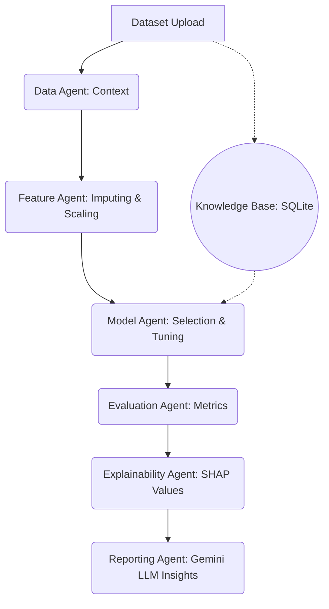

# AWIP: Adaptive Workflow Intelligence Platform 🚀

  
<strong>Intelligent automation for the machine learning lifecycle.</strong>

  
Accelerating dataset understanding, workflow recommendation, and model benchmarking.

 

## 🔗 Live Demo
**Try it yourself:** [AWIP Live Platform](https://adaptive-workflow-intelligence-plat-kappa.vercel.app/)

## 🛑 Problem
Machine learning workflows involve repetitive, highly-technical boilerplate: cleaning missing data, encoding categorical variables, scaling features, tuning hyperparameters, and evaluating metrics. Data scientists spend hours on these routine tasks before generating actual insights.

## 💡 Solution
**AWIP assists and automates large parts of the data science process.** When you upload a dataset, AWIP immediately provides:

1. **Dataset Understanding:** Automatically detects data quality issues and statistical properties.
2. **Workflow Recommendation:** Selects intelligent preprocessing steps and feature engineering tailored to your data.
3. **Model Benchmarking:** Trains and evaluates state-of-the-art models (XGBoost, LightGBM, RandomForest) to find the best performer.
4. **Decision Explainability:** Uses SHAP values and Google Gemini to explain *why* the winning model made its decisions.

Finally, it packages the winning workflow into an executable **Jupyter Notebook** and a **FastAPI deployment starter package** so you can seamlessly transition from experimentation to engineering.

## 💻 GitHub
The complete source code is available here: [GitHub Repository](https://github.com/Akshat1322/-Adaptive-Workflow-Intelligence-Platform)

---

## 📸 Platform Interface

  
   
  
   
  

---

## 🏗️ Architecture

## 🛠️ Tech Stack

  
  
  

 

- **Frontend:** Next.js 14, React, TailwindCSS, Zustand (Hosted on Vercel)
- **Backend:** FastAPI, Uvicorn, Python 3.12 (Hosted on Render)
- **Machine Learning:** Scikit-Learn, XGBoost, LightGBM, Pandas, Numpy
- **Generative AI:** Google Gemini GenAI SDK (`google-genai`)
- **Persistence:** SQLite via SQLAlchemy
