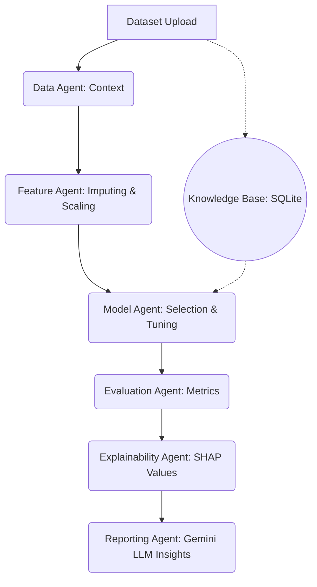

# AWIP: Adaptive Workflow Intelligence Platform 🚀

<div align="center">
  <p><strong>The platform that does the data science so you don't have to.</strong></p>
  <p>An end-to-end autonomous data science orchestration engine.</p>
</div>

<br />

<div align="center">
  <a href="https://adaptive-workflow-intelligence-plat-kappa.vercel.app/" target="_blank">
    
  </a>
  
  
  
</div>

<br />

## 🔗 Live Demo
**Try it yourself:** [AWIP Live Platform](https://adaptive-workflow-intelligence-plat-kappa.vercel.app/)

---

## 🛑 Problem Statement
Machine learning workflows involve repetitive, highly-technical boilerplate: cleaning missing data, encoding categorical variables, scaling features, tuning hyperparameters, and evaluating metrics. Data scientists spend hours on these routine tasks before generating actual insights. 

**AWIP solves this by automating the entire pipeline.** You upload a dataset, and AWIP's multi-agent system autonomously cleans the data, engineers features, trains state-of-the-art models, explains the results, and generates a production-ready API and Jupyter Notebook for deployment.

---

## 📸 Screenshots

| Dashboard | Real-Time Execution |
|:---:|:---:|
| *(Add dashboard screenshot here)* | *(Add execution screenshot here)* |
| **Pipeline Visualization** | **Model Insights** |
| *(Add pipeline screenshot here)* | *(Add results screenshot here)* |

---

## ✨ Features
- **7-Agent AI Orchestration:** Specialized agents handle Data Understanding, Feature Engineering, Model Selection, Evaluation, Explainability, Drift, and Reporting.
- **LLM-Powered Reasoning:** Powered by **Google Gemini** to generate natural language explanations and deep insights based on model metrics.
- **1-Click Export:** Instantly download the trained pipeline as an executable **Jupyter Notebook (.ipynb)** or a complete **FastAPI deployment package (ZIP)**.
- **Interactive DAG Visualization:** Real-time visual tracking of the pipeline's execution path.
- **Production-Ready Architecture:** Next.js frontend communicating with a high-performance Python FastAPI machine learning backend.

---

## 🏗️ Architecture



---

## 🛠️ Tech Stack

### Frontend
- **Framework:** Next.js 14, React
- **Styling:** TailwindCSS, Framer Motion
- **State Management:** Zustand
- **Icons & Visualization:** Lucide React, SVG DAG generation

### Backend
- **Framework:** FastAPI, Uvicorn
- **Machine Learning:** Scikit-Learn, XGBoost, LightGBM, Pandas, Numpy
- **Generative AI:** Google Gemini GenAI SDK (`google-genai`)
- **Persistence:** SQLite via SQLAlchemy

### Infrastructure
- **Frontend Hosting:** Vercel
- **Backend Hosting:** Render (Dockerized)

---

## 🚀 Quick Start (Local Development)

### 1. Prerequisites
- Python 3.12+
- Node.js 18+

### 2. Backend Setup
The backend environment and dependencies are neatly isolated in the `backend/` directory.

```bash
cd backend
pip install -r requirements.txt
pip install google-genai

# Add your Gemini API Key
export GEMINI_API_KEY="your-api-key"

# Start the FastAPI server
uvicorn main:app --reload --port 8000
```
*The backend runs on `http://127.0.0.1:8000`*

### 3. Frontend Setup
The frontend is a modern Next.js 14 application powered by TailwindCSS.

```bash
cd frontend
npm install
npm run dev
```
*The frontend runs on `http://localhost:3000`*

---

<div align="center">
  <p>Built for the modern data science lifecycle.</p>
</div>
