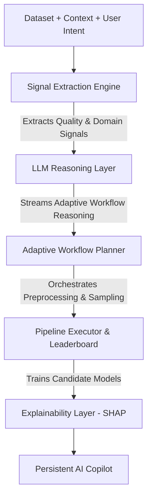

# AWIP — Adaptive Workflow Intelligence Platform


> **An LLM-driven adaptive workflow intelligence system for data science orchestration.**

## 🛑 The Problem

Modern data science workflows are typically static. Once built, a pipeline cannot natively adapt to new data distributions, altered schema, or varying downstream task requirements. Furthermore, as organizations scale, the expertise required to interpret and adjust these models becomes a bottleneck.

**The core challenge:**
*Design and evaluate data science language models that can adapt to different data science models.* 
Specifically, the industry needs a system that can intelligently adapt to regression, classification, clustering, and time-series analysis based on context, dataset interpretation, and user expertise.

## 💡 The Solution: AWIP

**AWIP** is an intelligent, self-evolving AI operating system for data science. Instead of relying purely on rigid coding rules, AWIP integrates Large Language Models (LLMs) natively into the orchestration layer.

The platform is designed as a **Workflow Intelligence Console** (inspired by Palantir and Cursor AI) that automatically:
1. **Interprets Datasets**: Reads schema, extracts contextual signals, and automatically routes the problem to Classification, Regression, Clustering, or Time-Series.
2. **Streams AI Reasoning**: Features a live "Adaptive Workflow Reasoning" panel that explains exactly why the dataset is being processed in a specific way.
3. **Recommends & Generates**: Automates the selection and execution of data science workflows (e.g., dynamically adding SMOTE if class imbalance is detected).
4. **Adapts to Drift**: Quantifies distribution shifts using statistical methods (KS-Test) and structurally evolves the pipeline in response, providing a visual "Before vs. After" evolution diff.
5. **Tailors Insights via Copilot**: Features a persistent AI Copilot docked to the side that dynamically adjusts its technical depth based on the user's expertise level (Beginner / Intermediate / Expert) to explain SHAP features and pipeline design.

---

## 🏗️ Architecture



## 🚀 How to Run It

AWIP uses **Streamlit** for the frontend UI (styled as a dark glassmorphism enterprise console) and **Ollama** to run the LLM reasoning engine entirely locally (ensuring complete data privacy).

### 1. Prerequisites
- Python 3.9+
- [Ollama](https://ollama.com/) installed on your machine.

### 2. Install Dependencies
Clone the repository and install the required Python packages:
```bash
git clone https://github.com/your-username/AWIP.git
cd AWIP

# Create virtual environment
python -m venv .venv
# Activate environment
# On Windows:
.venv\Scripts\activate
# On Mac/Linux:
source .venv/bin/activate

# Install requirements
pip install -r requirements.txt
```

### 3. Start the Local LLM
Open a new terminal window and start Ollama with the Llama 3 model (or Phi-3 if preferred):
```bash
ollama run llama3
```
*(Keep this terminal running in the background).*

### 4. Launch the Platform
In your Python environment terminal, run:
```bash
streamlit run app.py
```

---

## 🛠️ Tech Stack

- **UI Framework**: Streamlit (Custom Enterprise CSS Theme)
- **Data processing**: Pandas, NumPy, SciPy
- **Machine Learning**: Scikit-Learn, XGBoost, LightGBM, Imbalanced-Learn
- **Time-Series**: Prophet
- **Explainability**: SHAP
- **LLM Integration**: Ollama via Python `requests`
- **Visualization**: Plotly

## 📂 Repository Structure

- `app.py`: The main Streamlit application and UI orchestrator.
- `core/context_engine.py`: Analyzes datasets, detects tasks, and calculates real statistical drift (KS-Test).
- `core/workflow_engine.py`: The adaptive DAG generator that builds the pipeline.
- `core/pipeline_executor.py`: Compiles the DAG into scikit-learn/imblearn pipelines and runs the real model leaderboard.
- `core/llm_engine.py`: The interface to the local Ollama instance for generating pipeline narratives and powering the Copilot.
- `sample_data/`: Contains sample datasets (HR attrition clean, HR attrition drifted, Sensor data) for testing.
